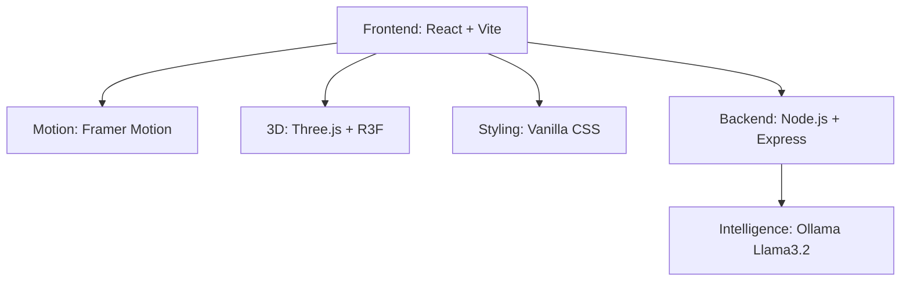

# 👁️ TRINETHRA v4.0
### The Neural Supervisor Feedback Intelligence Engine
**Software Developer Internship Assignment**

---

<div align="center">
  
  
  
  
</div>

---

## 🌌 Overview
**Trinethra** (The Third Eye) is a high-fidelity **Neural Workspace** designed to decode complex behavioral DNA from supervisor-intern transcripts. It transforms raw dialogue into structured, strategic behavioral rubrics with precision mapping to 8 critical KPI domains.

---

## 🚀 Cinematic Features

### 🧠 Neural Logic Engine
*   **Behavioral DNA Decoding**: Advanced pattern recognition to identify hidden signals in feedback.
*   **KPI Alignment**: Automated mapping to Technical Proficiency, Systemic Collaboration, and 6 other domains.
*   **Scoring Algorithms**: 1-10 logic-based scoring with deep-reasoning justifications.

### 🎨 High-Fidelity UI/UX
*   **Precision Crosshair Cursor**: A custom-engineered tracking system for a clinical, high-tech experience.
*   **Shutter Transitions**: Cinematic page wipes with animated "MISSION" and "NEURAL" status text.
*   **Neural Pulse Background**: A living obsidian theme with pulsing coordinate grids and noise textures.
*   **Glassmorphism 2.0**: Premium translucent components with neon glows and kinetic physics.

---

## 🛠 Tech Stack



---

## 🏗 Setup & Deployment

### 1. Prerequisites
*   Node.js (v18+)
*   Ollama (with `llama3.2` model)

### 2. Initialization
```bash
# 1. Pull the model (~2 GB)
ollama pull llama3.2

# 2. Clone and enter
git clone https://github.com/ayushtripathi-45/trinethra-analyzer.git
cd trinethra-analyzer

# 3. Start Backend
cd backend
npm install
node index.js

# 4. Start Frontend
cd ../frontend
npm install
npm run dev
```

Open **http://localhost:5173**

---

## 🔮 Future Roadmap: The Path to V5.0

- [ ] **Biometric Session Persistence**: Secure user history tracking.
- [ ] **Multi-Agent Synthesis**: Cross-supervisor behavioral mapping.
- [ ] **Real-Time Voice Analysis**: Direct audio-to-neural mapping.
- [ ] **Interactive DNA Visualizer**: 3D spider-charts of growth metrics.

---

## 📞 Contact

Built by **Ayush Tripathi** · [ayushtripathi9821@gmail.com](mailto:ayushtripathi9821@gmail.com) · [LinkedIn](https://linkedin.com/in/ayush-tripathi45)

---

<div align="center">
  <p><i>"Seeing beyond the obvious. Decoding the human element."</i></p>
  
  
</div>
