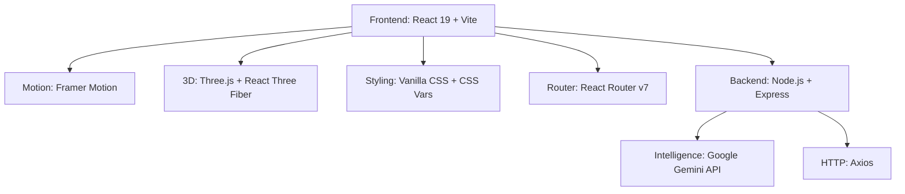

<p align="center">
  
</p>

<p align="center">
  
  
  
  
  
</p>

<p align="center">
  
  
  
  
</p>

---

<div align="center">
  
</div>

# 👁️ TRINETHRA v3.0 — *The Third Eye*

**Trinethra** is a high-fidelity **Neural Workspace** that decodes the behavioral DNA hidden inside supervisor → Fellow (early-career professional) transcripts. It strips away tone and supervisor bias, then returns a structured, logic-based behavioral rubric mapped to **8 critical KPI domains** and **4 assessment dimensions**.

> *"Decode supervisor feedback into actionable behavioral intelligence — not vibes."*

---

## 🌌 Overview

Traditional performance reviews are noisy, biased, and subjective. Trinethra turns informal dialogue into:

- a **1–10 DeepThought score** with justification + confidence,
- **evidence** quotes tagged positive / negative / neutral across 4 dimensions,
- **KPI mapping** (systemic vs. personal impact),
- **gap analysis**, and
- **follow-up questions** to close identified gaps.

The engine is powered by **Google Gemini** — no local model downloads, no warm-up, instant analysis.

---

## 🚀 Features

### 🧠 Neural Logic Engine
- **Behavioral DNA Decoding** — pattern recognition that surfaces hidden signals in feedback.
- **1–10 Rubric Scoring** — from *Not Interested (1)* to *Exceptional (10)*, with deep-reasoning justifications.
- **Bias Guardrails** — explicitly resists *presence bias*, *helpfulness bias*, and *task absorption ≠ systems building*.
- **8 KPI Domains** — Lead Gen, Lead Conversion, Upselling, Cross-selling, NPS, PAT, TAT, Quality.
- **4 Dimensions** — Driving Execution, Systems Building, KPI Impact, Change Management.

### 🎨 High-Fidelity UI/UX
- **Cursor-Reveal Grid** — the background grid illuminates around your mouse for a premium "neural scan" feel.
- **Shutter Page Transitions** — cinematic wipes with animated `CORE / MISSION / NEURAL / V1.0 / V2.0 / V3.0` status text.
- **Living Obsidian Theme** — pulsing radial glows, coordinate grid, and film-grain noise.
- **Glassmorphism 2.0** — translucent cards with neon glows and hover physics.
- **Three-Font System** — *Archivo Narrow* (UI), *Aref Ruqaa* (display), *Martel* (body) for an editorial, premium feel.

---

## 🗺️ Version Journey

| Version | Status | Highlights |
| :--- | :--- | :--- |
| **v1.0** | 🟥 Retired | First local-Ollama prototype. Basic 1–10 scoring, single flat JSON. Proved the concept. |
| **v2.0** | 🟧 Superseded | Hardened JSON extraction, split evidence / KPI / gaps, retry-with-instructions, tuned bias guardrails. Still local-model bound. |
| **🟦 v3.0 (Current)** | 🟢 Operational | **Gemini-powered.** Zero-config backend (single `GEMINI_API_KEY`), structured 4-block output every time, instant analysis. Foundation for accounts & teams. |

> Learn more on the in-app **v1.0**, **v2.0**, and **Upcoming** pages.

---

## 🛠 Tech Stack



| Layer | Stack |
| :--- | :--- |
| Frontend | React 19, Vite 8, Framer Motion, React Router, Three.js |
| Backend | Node.js, Express 5, Axios, Dotenv |
| AI | Google Gemini (`gemini-3.5-flash`), `responseMimeType: application/json` |
| Styling | CSS custom properties, glassmorphism, grid + noise overlays |

---

## 🏗 Setup & Deployment

### 1. Prerequisites
- **Node.js** v18+
- A **Google Gemini API Key**

### 2. Backend
```bash
cd backend
npm install

# Create a .env file with your key:
# GEMINI_API_KEY="your_key_here"

npm start          # or: node index.js
# Backend runs at http://localhost:8000
```

### 3. Frontend
```bash
cd frontend
npm install
npm run dev        # Vite dev server
# Open http://localhost:5173
```

> The frontend calls `http://localhost:8000/analyze`. Make sure the backend is running first.

### 4. Try it instantly
Grab sample conversations from **[`DEMO_TRANSCRIPTS.md`](./DEMO_TRANSCRIPTS.md)** and paste them into the **Explore** page.

---

## 🔮 Roadmap — *Upcoming (v4+)*

Tracked live on the in-app **Upcoming** page. Planned:

- [ ] **User Accounts** — email + OAuth login / sign-up, saved transcript history.
- [ ] **Team Workspaces** — invite supervisors, share analyses, aggregate cohort performance.
- [ ] **Export & Public API** — PDF / CSV exports and an API-key tier.
- [ ] **Multimodal Intake** — upload meeting recordings & chat exports, not just pasted text.
- [ ] **Interactive DNA Visualizer** — 3D spider-charts of growth metrics.

---

## 📂 Project Structure

```
trinethra-analyzer/
├── backend/                 # Node.js + Express + Gemini
│   ├── index.js             # /analyze endpoint, Gemini integration
│   ├── package.json
│   └── .env                 # GEMINI_API_KEY (git-ignored)
├── frontend/                # React + Vite
│   └── src/
│       ├── pages/           # Home, About, Explore, Version1, Version2, Upcoming
│       ├── components/      # Navbar, Preloader, CustomCursor
│       ├── App.jsx          # Routing + animated transitions
│       ├── index.css        # Design tokens, background, grid-reveal
│       └── App.css          # Layout & results
├── DEMO_TRANSCRIPTS.md      # Sample prompts to test
└── README.md
```

---

## 📞 Contact

Built by **Ayush Tripathi**
📧 [ayushtripathi9821@gmail.com](mailto:ayushtripathi9821@gmail.com)
🔗 [LinkedIn](https://linkedin.com/in/ayush-tripathi45)
💻 [GitHub](https://github.com/ayushtripathi-45/trinethra-analyzer)

---

<div align="center">
  
  <p><i>"Seeing beyond the obvious. Decoding the human element."</i></p>
</div>
